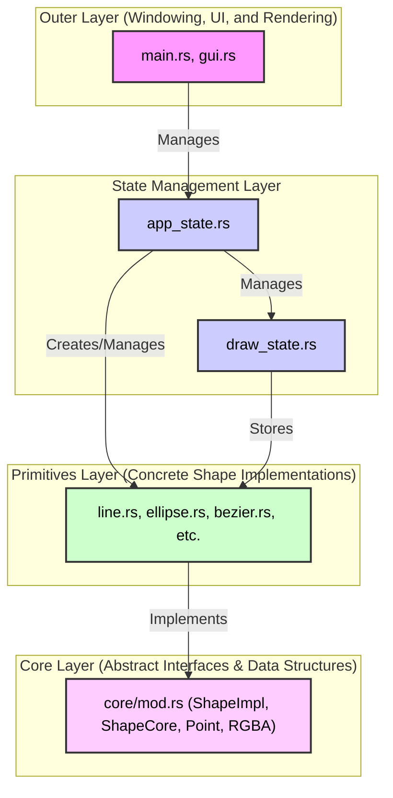

# Paint App

A simple paint application built with Rust. Made for Graphics Introduction at Central University of Venezuela by Rafael E. Contreras :) 

## How to Run

### Windows

This project includes a PowerShell script (`build.ps1`) that automates the entire setup and build process.

1.  **Open PowerShell**: Navigate to the project's root directory.
2.  **Execution Policy (If you have an error)**: If you get an error about script execution being disabled, run the following command to allow the script to run for the current process, then try step 2 again:
    ```powershell
    Set-ExecutionPolicy RemoteSigned -Scope CurrentUser
    ```
3.  **Run the Build Script**: Execute the following command:
    ```powershell
    .\build.ps1
    ```
4.  Restore the default execution policy. If the default was another one, change it to that one.
    ```powershell
    Set-ExecutionPolicy Restricted
    ```
5.  **Run the App**: After the build is complete, the executable will be located at `target\release\paint_app.exe`. You can run it with:
    ```powershell
    .\target\release\paint_app.exe
    ```

### Linux

1.  **Install Rust**: If you don't have Rust installed, you can install it with:
    ```bash
    curl --proto '=https' --tlsv1.2 -sSf https://sh.rustup.rs | sh
    ```
2.  **Build and Run**: Navigate to the project's root directory and run the following commands:
    ```bash
    source prepare.sh
    cargo run --release
    ```

## Architecture

The application is designed with a layered architecture to promote separation of concerns, making it modular and easier to maintain. Each layer has a distinct responsibility, and dependencies flow from the outer layers to the inner layers.



### Layers Explained

1.  **Core Layer**: This is the innermost layer and the foundation of the application. It defines the abstract interfaces (`ShapeImpl` trait) and fundamental data structures (`ShapeCore`, `Point`, `RGBA`) that are used throughout the project. This layer has no dependencies on any other part of the application, making it highly reusable.

2.  **Primitives Layer**: This layer contains the concrete implementations of the shapes defined in the Core Layer. Each primitive (`Line`, `Ellipse`, `Rectangle`, `Bezier`, etc.) implements the `ShapeImpl` trait, providing specific logic for drawing, hit-testing, and updating itself.

3.  **State Management Layer**: This layer is responsible for managing the application's state.
    *   `draw_state.rs`: Manages the canvas, including the list of shapes, background color, and the history for undo/redo operations. It is designed to be independent of any specific UI or rendering library.
    *   `app_state.rs`: Orchestrates the overall application logic. It handles user input, manages the current drawing state (e.g., selected shape, colors), and acts as a bridge between the UI and the `draw_state`.

4.  **Outer Layer**: This is the most external layer, responsible for windowing, user interface, and rendering.
    *   `main.rs`: The entry point of the application. It initializes the window, handles the event loop (using `winit`), and manages the `pixels` buffer for rendering.
    *   `gui.rs`: Manages the GUI using the `egui` library. It displays controls for the user to interact with the application and communicates user actions to the `app_state`.

This layered approach ensures that the core drawing and state management logic is decoupled from the specific libraries used for the UI and rendering. For example, `winit`, `pixels`, and `egui` could be swapped out with other libraries with minimal changes to the inner layers.


## Requirements Implementations

This section explains where and how to use each requested feature.

### General Deployment (7 points)

- **Line:** Select "Line" in the selector and draw it. To draw, click, drag, and release.
- **Ellipse:** Select "Ellipse" and draw it the same way as a line.
- **Rectangle:** Select "Rectangle" and draw it the same way as a line.
- **Triangle:** Select and hold to draw the first two corners. Release and move to position the third corner, then click again to fix it.
- **Bézier Curve:** Click consecutively to add control points, then right-click to finish.

### Basic Functionalities (4 points)

- **Current Border Color:** Use the color selector in the UI. All colors have a default transparency of 0, which must be specified.
- **Current Fill Color:** Use the color selector in the UI.
- **Object Selection:** Select an object; the mouse cursor will indicate when it is over a selectable object.
- **Primitive Selector:** Selector on the left.
- **Point Modification:** Move the red control points on each figure. In this app, we define control points as the points used to define/draw the figure.
- **Selective Deletion:** Select the figure and press DEL or Backspace to delete it.
- **Control Points:** Color selector on the left.

### Bézier Curve (2 points)

- **Control Polygon:** When a Bézier curve is *selected*, a "Bezier Settings" panel appears on the left. Here, you can select the color of its control polygon ("Polygon Color").
- **Curve Degree:** In "Bezier Settings," select "Degree Elevate."
- **Subdivision:** When a Bézier curve is selected, a point appears on the curve (similar to the control polygon points). This is the subdivision point. With the Bézier curve selected, you can divide it at that point by clicking "Subdivide."

### Special Features (5 points)

- **Persistence:** In the top-left corner, select the "File" button. This will give you the option to load/save drawings.
- **Layer Order:** When a figure is selected, you will have access to the "Depth" section. Here, there are buttons to move a figure ±1 space ("Forward"/"Backward") or all the way to the front/back ("To Front"/"To Back").
- **Contextual Cursors:** This can be observed. The cursor also changes when dragging figures.
- **Clear All:** "Clear Canvas" button.
- **SHIFT Key Constraints:** When creating a rectangle/ellipse, holding SHIFT will maintain the same width/height.
- **Transparency (Alpha Blending):** Achieved by filling figures with transparency.
- **Canvas Background:** "Background" color picker.

### Quality and Consistency (2 points)

- **Best Practices:** Evaluation of comments, readability, OOP, abstract classes, and scalability (1 point).
- **Interface Precision:** Accuracy in object selection and overall usability (1 point).

### Optional Features (6 points)

- **Undo/Redo:** Achieved with the arrows at the top (4 points).
- **Clipboard:** Achieved by selecting a figure. Ctrl + C (copy), Ctrl + X (cut), Ctrl + V (paste). If you copy/cut and then paste into a text editor, you can see how a figure is serialized into a string (2 points).
- **Move Figure:** This was not in the original list of requirements but was implemented anyway.

### Important Notes and Clarifications

- **Architecture:** Review the architecture section.
- **Algorithms:** Integer arithmetic is used for lines (including line detection), ellipses, and rectangles. As discussed in class, integer arithmetic is not used for Bézier curves and triangles.
- **Interactivity:** All figures are modifiable after their creation.
- **Memory:** Thanks to Rust, it is not necessary to focus on this, as the "ownership and borrowing" paradigm allows us to automatically free up unused memory spaces without a garbage collector.
- **Efficiency:** Most operations were sought to be as efficient as possible. In addition to having these [benchmarks](https://github.com/dmitryikh/rust-vs-cpp-bench) of the language used.

