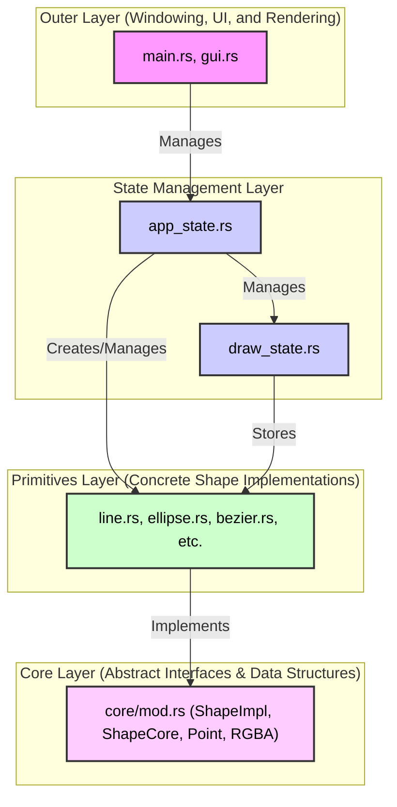

# Paint App

A simple paint application built with Rust. Made for Graphics Introduction at Central University of Venezuela by Rafael E. Contreras :) 

## How to Run

### Windows

This project includes a PowerShell script (`build.ps1`) that automates the entire setup and build process.

1.  **Open PowerShell**: Navigate to the project's root directory.
2.  **Execution Policy (If you have an error)**: If you get an error about script execution being disabled, run the following command to allow the script to run for the current process, then try step 2 again:
    ```powershell
    Set-ExecutionPolicy RemoteSigned -Scope CurrentUser
    ```
3.  **Run the Build Script**: Execute the following command:
    ```powershell
    .\build.ps1
    ```
4.  Restore the default execution policy. If the default was another one, change it to that one.
    ```powershell
    Set-ExecutionPolicy Restricted
    ```
5.  **Run the App**: After the build is complete, the executable will be located at `target\release\paint_app.exe`. You can run it with:
    ```powershell
    .\target\release\paint_app.exe
    ```

### Linux

1.  **Install Rust**: If you don't have Rust installed, you can install it with:
    ```bash
    curl --proto '=https' --tlsv1.2 -sSf https://sh.rustup.rs | sh
    ```
2.  **Build and Run**: Navigate to the project's root directory and run the following commands:
    ```bash
    source prepare.sh
    cargo run --release
    ```

## Architecture

The application is designed with a layered architecture to promote separation of concerns, making it modular and easier to maintain. Each layer has a distinct responsibility, and dependencies flow from the outer layers to the inner layers.



### Layers Explained

1.  **Core Layer**: This is the innermost layer and the foundation of the application. It defines the abstract interfaces (`ShapeImpl` trait) and fundamental data structures (`ShapeCore`, `Point`, `RGBA`) that are used throughout the project. This layer has no dependencies on any other part of the application, making it highly reusable.

2.  **Primitives Layer**: This layer contains the concrete implementations of the shapes defined in the Core Layer. Each primitive (`Line`, `Ellipse`, `Rectangle`, `Bezier`, etc.) implements the `ShapeImpl` trait, providing specific logic for drawing, hit-testing, and updating itself.

3.  **State Management Layer**: This layer is responsible for managing the application's state.
    *   `draw_state.rs`: Manages the canvas, including the list of shapes, background color, and the history for undo/redo operations. It is designed to be independent of any specific UI or rendering library.
    *   `app_state.rs`: Orchestrates the overall application logic. It handles user input, manages the current drawing state (e.g., selected shape, colors), and acts as a bridge between the UI and the `draw_state`.

4.  **Outer Layer**: This is the most external layer, responsible for windowing, user interface, and rendering.
    *   `main.rs`: The entry point of the application. It initializes the window, handles the event loop (using `winit`), and manages the `pixels` buffer for rendering.
    *   `gui.rs`: Manages the GUI using the `egui` library. It displays controls for the user to interact with the application and communicates user actions to the `app_state`.

This layered approach ensures that the core drawing and state management logic is decoupled from the specific libraries used for the UI and rendering. For example, `winit`, `pixels`, and `egui` could be swapped out with other libraries with minimal changes to the inner layers.
