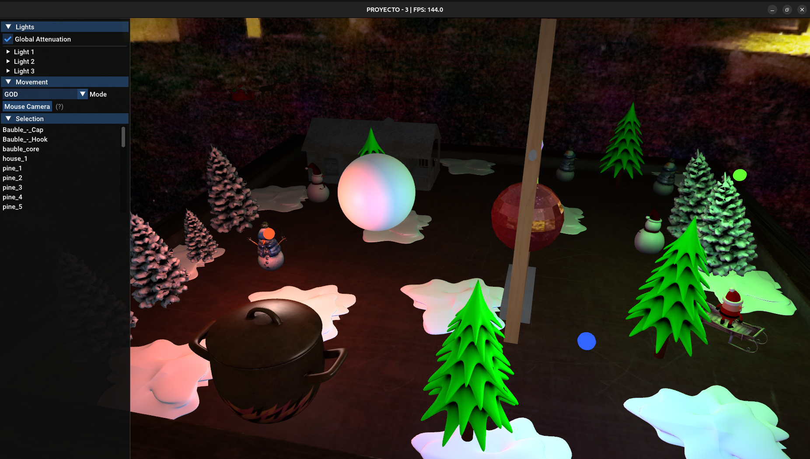

# Proyecto #3 - Motor de Renderizado 3D (Escena en Miniatura)

## Introducción
Bienvenidos al **Proyecto #3**, una experiencia de visualización 3D diseñada para sumergir al usuario en un mundo temático "en miniatura". Toda la escena está situada sobre una mesa de madera, donde objetos comunes como una casa, una maceta y decoraciones navideñas adquieren una escala colosal en relación con el espectador. Asumes el papel de un "hombre miniatura" explorando este paisaje de escritorio, navegando a través de una atmósfera nevada iluminada por fuentes de luz danzantes.

Un motor de renderizado 3D en C++ de alto rendimiento construido con OpenGL 3.3, que cuenta con iluminación avanzada, mapeo de texturas y una interfaz de usuario interactiva.

---

## Cómo ejecutar

### Linux
1. **Prerrequisitos**: Instalar GLFW y GLM (ej. `sudo apt install libglfw3-dev libglm-dev`).
2. **Compilar**: Ejecutar `make` en el directorio raíz.
3. **Ejecutar**: Ejecutar `./build/proy3`.

### Windows
1. **Prerrequisitos**: Asegurarse de tener un compilador de C++ (como MinGW/GCC o MSVC) y los archivos de desarrollo de GLFW.
2. **Compilar**: Usar el `Makefile` proporcionado con `make` (vía MinGW) o enlazar los archivos en `src/` manualmente en un IDE.
3. **Ejecutar**: Ejecutar el archivo `.exe` generado en la carpeta `build/`.

---

## Mapa de Funcionalidades (Requerimientos del PDF)

### 1. La Escena en Miniatura (Mini-man)
* **Concepto**: Toda la escena está sobre una mesa de madera. La cámara comienza en **Modo FPS** a una altura de `-1.5` (`targetY`), simulando a un "humano miniatura" caminando sobre la superficie de la mesa.
* **Esfera Reflectiva**: Se encuentra en el centro de la escena. Tenga en cuenta que, aunque aparece como un solo objeto, es una entidad compleja compuesta por múltiples partes (Submeshes).

### 2. Iluminación y Luces
* **Tres Luces RGB**: Tres esferas (Roja, Verde, Azul) orbitan la mesa en trayectorias circulares "armoniosas".
* **Controles de la Interfaz (UI)**:
  * **Ubicación**: Se encuentran bajo el encabezado desplegable **"Lights"**.
  * **RGB/Intensidad**: Use los editores de color y los deslizadores de intensidad para modificar cada luz.
  * **Atenuación (f_att)**: La casilla "Global Attenuation" activa o desactiva la caída de luz basada en la distancia (valor: 0.5pts).
  * **Velocidad de Animación**: Modifique qué tan rápido se mueven las "luciernagas" usando el deslizador "Anim Speed".
  * **Modelos de Sombreado**: Cambie cada luz entre **Phong**, **Blinn-Phong** y **Flat** usando el menú desplegable.

### 3. Movimiento y Cámara
* **Modos**: Cambie entre **FPS** (ignora el eje Y) y **GOD** (modo de vuelo) en el encabezado **"Movement"**.
* **Controles**: Use `W/A/S/D` o las `teclas de dirección` para moverse. Presione `ENTER` para bloquear el ratón y rotar la cámara, y `ESC` para liberarlo.

### 4. Escena Animada
* **Santa**: Trayectorias circulares tanto volando como en el suelo.
* **Muñecos de Nieve**: Animaciones de rotación en las variantes rojas y azules.
* **Pinos**: Animaciones de escalado dinámico en árboles específicos.

### 5. Mapeo de Texturas y Materiales
* **Carga Automática**: Las texturas de los archivos OBJ/MTL se cargan automáticamente.
* **Mapeo Interactivo**:
  * **Ubicación**: Seleccione un objeto en la caja de **"Selection"** para abrir el panel de **"Edit"**.
  * **s-mapping**: Elija entre **Standard** (UV), **Spherical** (Esférico) y **Squared** (Cuadrado). Para apreciar mejor este efecto, seleccione la **Esfera Paramétrica** (bola de nieve gigante flotante) en el centro de la escena.
  * **o-mapping**: Cambie entre generación de coordenadas basada en **Position** (Posición) o **Normal**.
* **Bump Mapping**: Use el botón "Set Bump Map" en el panel de edición. Se visualiza mejor en la **Esfera Paramétrica** central para ver las "grietas" de la superficie sin cambiar la geometría real.
* **Skybox**: Se utiliza un mapa de entorno nevado para el fondo de la habitación y las reflexiones.

---

## Funcionalidades Extra (Más allá del PDF)

* **Carga Asíncrona**: El motor utiliza un **hilo (thread) de trabajo separado** para cargar la escena OBJ y las texturas. Esto evita que el sistema operativo "congele" la ventana durante la fase pesada de entrada/salida. Se muestra una pantalla de carga hasta que la carga en la GPU esté lista.
* **Oclusión Ambiental (AO)**: Utilizamos el slot de **Ambient Texture** para renderizar mapas de AO pre-calculados. Puede ver estas sombras sutiles y realistas en las esquinas de la **Maceta**, los **Árboles**, la **Casa** y los **Muñecos de Nieve**.
* **Mapeo Especular**: Objetos específicos como la **Maceta** y los **Muñecos de Nieve Azules** usan mapas especulares para definir qué partes son más brillantes que otras (ej. el esmalte de la maceta vs. el borde metálico).
* **Reflexiones de Entorno**: La **Bambalina/Esfera de Navidad** en el árbol central tiene un alto factor de reflectividad, actuando como un espejo opaco que refleja el Skybox en tiempo real.
* **Texturas Personalizadas**: La interfaz le permite **agregar cualquier archivo de imagen** como mapa Difuso o de Relieve (Bump) a **cualquier objeto** de la escena.
* **Brillo de la Luz (Shininess)**: El "foco" (brillo) de cada luz puede ser ajustado, afectando qué tan nítidos o amplios aparecen los reflejos especulares en las superficies.
* **Abstracción de Submeshes**: Para simplificar la experiencia del usuario, aplicar una textura a nivel de Objeto actualiza automáticamente cada sub-malla dentro de ese modelo simultáneamente.
* **Alta Complejidad**: Una escena a gran escala con docenas de objetos animados y jerarquías complejas, todo ejecutándose a altos FPS.
